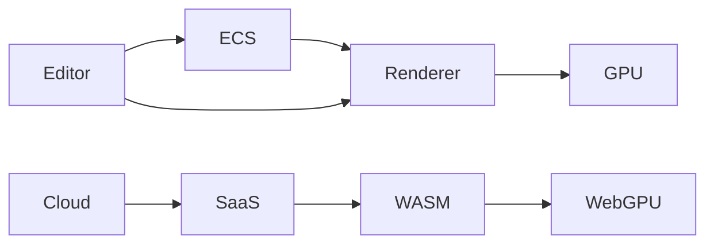

# w3drs

> **Next-gen GPU-driven 3D engine for Web & Native — built in Rust**

w3drs est un moteur 3D nouvelle génération conçu pour offrir des performances proches du natif dans le navigateur grâce à WebGPU, tout en conservant une architecture unifiée entre **local, web et cloud**.

---

## ✨ Features

* 🚀 **GPU-Driven Rendering** (Draw Indirect, Hi-Z Culling)
* 🧠 **Multi-threading déterministe** (Rayon + ECS Archetypes)
* 🌐 **WebGPU / WASM First**
* 🧩 **Architecture Plugin-First**
* 🏗️ **ECS haute performance (SoA / Archetypes)**
* ☁️ **Architecture isomorphe (Local ↔ SaaS)**
* 🎨 **Éditeur multi-mode (Design / CAO / Logic / Debug)**
* 🤖 **IA optionnelle (local + cloud)**

---

## 🎯 Vision

> Deliver **Unreal Engine–level rendering** inside the browser.

w3drs vise à créer une nouvelle catégorie :

> **Engine-as-a-Service Isomorphe**

* même code → local / web / cloud
* performances GPU-first
* workflow unifié

---

## 🧱 Architecture



### Core Modules

| Module               | Description        |
| -------------------- | ------------------ |
| `w3drs-core`         | ECS + math         |
| `w3drs-renderer`     | pipeline WebGPU    |
| `w3drs-assets`       | format W3DB        |
| `w3drs-editor-ui`    | interface          |
| `w3drs-wasm`         | runtime web        |
| `w3drs-cloud-bridge` | communication SaaS |

---

## ⚙️ Key Concepts

### 🧠 ECS Archetypes (SoA)

* stockage contigu
* cache-friendly
* SIMD-ready
* multi-thread natif

### 🎮 GPU-Driven Rendering

* culling GPU (Hi-Z)
* indirect draw calls
* réduction CPU bottleneck

### 🔌 Plugin System

* traits Rust
* isolation totale
* extensibilité compile-time

### ☁️ Isomorphic Compute

Même logique exécutée :

| Mode  | Exécution     |
| ----- | ------------- |
| Local | Rust natif    |
| Web   | WASM          |
| Cloud | microservices |

---

## 📊 Performance Targets

### Native

| Metric     | Target     |
| ---------- | ---------- |
| FPS        | 120+       |
| Triangles  | 10M – 50M+ |
| Draw Calls | 100k+      |

### Web (WebGPU)

| Metric    | Target          |
| --------- | --------------- |
| FPS       | 60–100          |
| Triangles | 5M – 20M        |
| Perf Loss | < 20% vs native |

---

## 🧪 Benchmarks

* ECS: 100k entities < 2ms
* Rendering: 10k+ draw calls < 8ms
* Streaming: 1GB assets sans stutter

---

## 🌐 Web Optimization Strategy

* Render Bundles
* Bindless textures
* WASM SIMD (128-bit)
* Zero-copy asset streaming

---

## 📦 Workspace Structure

```bash
/my-w3drs-project/
├── assets/        # raw assets
├── src/           # scenes (.w3s)
├── shaders/       # WGSL
├── dist/          # build output (.w3db)
└── .w3cache/      # local cache
```

---

## 🔄 Asset Pipeline

1. Import assets
2. Processing (compression, LOD, meshlets)
3. Baking → `.w3db`
4. Hot reload

---

## 🧩 Editor Modes

* **Design** → scene assembly
* **Modeling** → mesh editing (GPU)
* **CAD** → parametric precision
* **Logic** → visual scripting
* **Debug** → profiling
* **Ship** → WASM export

---

## 🤖 AI Integration (Optional)

> AI is a **copilot, not a dependency**

| Domain    | Feature         |
| --------- | --------------- |
| Modeling  | mesh generation |
| Logic     | NLP scripting   |
| Rendering | shader assist   |
| Animation | auto rigging    |

* Local (Candle / LLM quantized)
* Cloud (Gemini / SD / etc.)
* Always reversible

---

## ☁️ SaaS Architecture

Heavy tasks offloaded:

* CAD tessellation
* Global illumination baking
* Shader compilation
* Mesh optimization

### Benefits

* WASM < 5MB
* scalable compute
* unified UX

---

## 🛣️ Roadmap

### Phase 3 — Foundations

* ECS Archetypes
* Plugin System

### Phase 4 — Creation

* Modeling tools
* Lighting system

### Phase 5 — Ultra Quality

* DDGI
* Full GPU-driven pipeline

---

## ⚠️ Challenges

* GPU-driven renderer complexity
* CAD interoperability
* Browser limitations (WebGPU, threading)

---

## 🏁 Positioning

| vs             | Advantage                    |
| -------------- | ---------------------------- |
| Unity / Unreal | Web-native + lightweight     |
| Three.js       | Performance + multithreading |

---

## 🚀 Getting Started (WIP)

```bash
git clone https://github.com/your-org/w3drs
cd w3drs
cargo build
```

---

## 📜 License

TBD

---

## 🤝 Contributing

Contributions are welcome.

Focus areas:

* ECS optimization
* WebGPU renderer
* editor tooling

---

## 🧠 Final Thought

w3drs n’est pas un moteur de plus.

> C’est une tentative de redéfinir la 3D temps réel pour le web.

---
