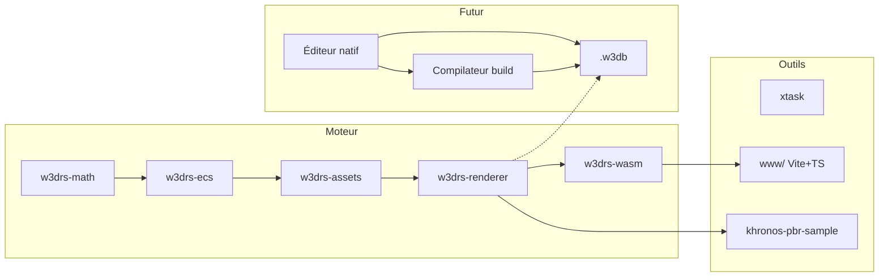
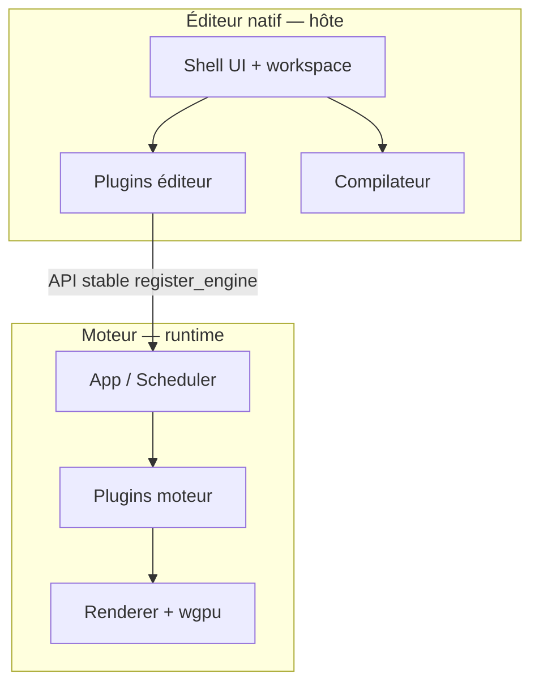
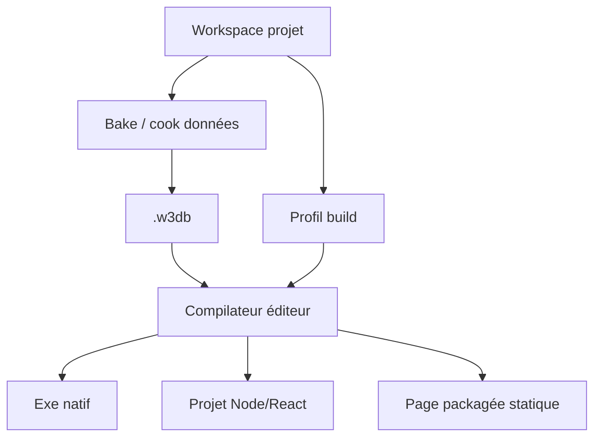

# Architecture w3drs

Document **vivant** : on y consigne l’**architecture du moteur**, de l’**éditeur**, des **formats de fichiers**, et des **diagrammes** (graphes de dépendances, pipelines, données). L’**état d’implémentation** au fil du temps reste aussi tracé dans [journal.md](journal.md).

## Sommaire

| Section | Contenu |
|---------|---------|
| [Vue d’ensemble](#vue-densemble) | Périmètres moteur / éditeur / données |
| [Moteur — runtime (détail)](#moteur--runtime-détail) | Crates, ECS, renderer, GPU-driven, plugins |
| [Éditeur (cible)](#éditeur-cible) | Workspace, UI native / `www/`, extensions |
| [Architecture plugins (modulaire)](#architecture-plugins-modulaire) | Moteur runtime + éditeur natif : traits, manifestes, cycle de vie |
| [Compilateur & livrables](#compilateur--livrables) | Build depuis l’éditeur : exe natif, projet Node/React, page packagée |
| [Formats de fichiers](#formats-de-fichiers) | `.w3db`, glTF, graphes, config |
| [Diagrammes](#diagrammes) | Graphes Mermaid et index des schémas |

---

## Vue d’ensemble



- **Moteur** : Rust + `wgpu`, cible **WASM** et **natif** (même logique cœur autant que possible).
- **Éditeur** : hors crates moteur ; consomme API stable + fichiers **data-driven** ; produit **`.w3db`** (voir [ROADMAP](ROADMAP.md)).
- **Compilateur** : depuis l’éditeur natif, **pipeline de build** qui transforme le workspace + graphes / assets en **livrables** (voir [section dédiée](#compilateur--livrables)).
- **Plugins** : **moteur** (composition runtime Rust) et **éditeur** (extensions UI / outils) — [architecture modulaire](#architecture-plugins-modulaire).
- **Formats** : glTF runtime, futur **`.w3db`**, descriptions de **render graph** / **shader graph** / physique en données versionnées.

---

## Éditeur (cible)

| Aspect | Décision / direction |
|---------|----------------------|
| **Modèle projet** | **Workspace** sur disque (voir [Goals.md](Goals.md)) : `assets/`, `src/`, `shaders/`, `dist/*.w3db`, `.w3cache/`. |
| **UI** | **Priorité de livraison :** shell **natif** d’abord (même référence UX) ; **`www/`** allégé ensuite / en parallèle pour démo / validation web / WASM ; maquette : [design/README.md](design/README.md). |
| **Extensions** | Plugins éditeur + pont moteur : voir [Architecture plugins (modulaire)](#architecture-plugins-modulaire) ; contrat type `register_engine(api)` ; **multithread** ; pas de logique gameplay dans le crate renderer. |
| **Compilateur** | Commande **Build / Compiler l’expérience** : voir [Compilateur & livrables](#compilateur--livrables) — sorties exe natif, projet **Node.js / React**, ou **page packagée** (type build Web Unity). |
| **Tests** | Scènes de référence par phase : [`fixtures/phases/`](../fixtures/phases/README.md) + tickets [`tickets/`](tickets/README.md). |

*Diagrammes éditeur (layout docking, bus UI ↔ moteur) : à ajouter ici lorsque l’implémentation démarre (fichiers Mermaid ou liens vers images exportées).*

---

## Architecture plugins (modulaire)

Le produit repose sur une **modularité à deux niveaux** : des **plugins moteur** (composition du runtime Rust — ECS, rendu, loaders) et des **plugins éditeur** (extensions de l’outil auteur — panneaux, importeurs, hooks de build). Les deux familles sont **data-driven** dans la mesure du possible (manifestes, ordres de chargement, capacités déclarées).

### Concrètement : une DLL (natif) ou un wasm (web) par plugin

**Oui, comme règle de produit par défaut** — une extension = **un artefact binaire chargeable** par l’hôte, distinct du cœur (éditeur ou runtime).

| Plateforme | Artefact | Règle |
|------------|----------|--------|
| **Natif** (Windows / macOS / Linux) | **Une bibliothèque dynamique par plugin** : `.dll` / `.dylib` / `.so` | Chargement runtime (`dlopen` / `LoadLibrary` / équivalent) + **ABI stable** (C ou interface versionnée) + manifeste à côté du binaire. |
| **Web** | **Un module WebAssembly par plugin** : fichier **`.wasm`** (+ glue **JS** / TS généré ou minimal) | Chargement via **`WebAssembly.instantiate`** / `instantiateStreaming` depuis l’hôte ; **pas** d’équivalent `dlopen` : chaque plugin est donc typiquement **son propre wasm** (URL ou bundle séparé). |

**Nuances (à ne pas confondre avec la règle par défaut)** :

- **Moteur « tout statique »** : pour un exécutable minimal ou le **navigateur**, les plugins peuvent être **fusionnés** dans un seul binaire (features Cargo, **un seul** `w3drs_wasm.wasm`) avec une **table de plugins** en dur — utile quand le nombre de modules est figé ; ce n’est plus « une DLL / un wasm **par** plugin » mais « une crate / un wasm **pour tous** ».
- **Éditeur** : la modularité « une DLL / un wasm par extension » vise surtout les **plugins éditeur** tiers ; le **runtime moteur** peut rester une lib unique exposant une API d’enregistrement.
- **Sécurité web** : chaque `.wasm` additionnel impose contrôle **COOP / COEP** et **origine** si `SharedArrayBuffer` ou threads ; à documenter par profil de build.

### Vue d’ensemble (moteur ↔ hôte ↔ éditeur)



- L’**éditeur** ne lie pas le renderer par dépendance directe : il parle au moteur via une **API hôte** (FFI, canal commandes, ou process enfant — choix d’implémentation à figer).
- Les **plugins moteur** n’embarquent **pas** de widgets UI ; les **plugins éditeur** peuvent ouvrir des vues et déclencher des commandes moteur.

---

### Plugins moteur (Rust, runtime)

| Sujet | Décision |
|-------|----------|
| **Modèle** | Trait `Plugin` enregistré sur une structure **`App`** (monde ECS + scheduler + registres) — voir extrait ci-dessous dans [Plugin system](#plugin-system-phase-3a). |
| **Responsabilités typiques** | Enregistrer **systèmes ECS**, ressources GPU, passes de rendu ou extensions **render graph**, importeurs d’assets, backends format (OBJ, STEP, …) derrière interfaces communes. |
| **Ordre & dépendances** | Graphe **DAG** de plugins (manifeste data ou macro `depends_on`) pour éviter les cycles ; ordre de `build()` déterministe et **testé**. |
| **WASM vs natif** | Par défaut : **natif = DLL/dylib/so par plugin** ; **web = un `.wasm` par plugin** — voir la sous-section **Concrètement** ci-dessus. Variante **statique** : plugins regroupés dans l’exe ou dans un seul wasm (features + table) quand le produit le requiert. |
| **Frontière** | Aucun plugin moteur ne dépend d’une crate **UI éditeur** ; les types publics restent dans des crates **`w3drs-*`**. |

---

### Plugins éditeur natif (hôte auteur)

| Sujet | Décision |
|-------|----------|
| **Modèle** | **Module d’extension** = manifeste (`plugin.json` / RON) + point d’entrée (`register_editor(api)` / `activate`) exposant panneaux, commandes, importers et **optionnellement** un pont `register_engine(api)` vers le runtime. |
| **Découverte** | Dossiers sous `extensions/` du workspace ou chemins listés dans la config éditeur ; **scan** au démarrage + validation de schéma. |
| **Cycle de vie** | Activation / désactivation ; rechargement à chaud **en dev** uniquement si sûr ; en prod build **figé** via le [compilateur](#compilateur--livrables). |
| **UI** | Contributions **data-driven** quand c’est possible (déclaration de panneaux, menus, raccourcis dans le manifeste) ; code Rust ou script hôte pour la logique interactive. |
| **Multithreading** | Travaux lourds (import STEP, bake textures) dans des **jobs** ; thread UI ne bloque pas sur I/O ou GPU. |
| **Sécurité** | Préférence pour extensions **signées** ou liste blanche workspace en prod ; documenter le modèle de menace. |

**Référence ticket** : [phase K — éditeur & extensions](tickets/phase-K-editeur-workspaces.md).

---

## Compilateur & livrables

L’**éditeur natif** expose un **compilateur d’expérience** : à partir du **workspace** (sources, graphes, shaders, config) et du paquet runtime **`.w3db`** (bake intermédiaire ou final), il produit un **livrable jouable / déployable** — sans recopier manuellement les étapes `wasm-pack` / Vite aujourd’hui dispersées.

### Entrées

| Entrée | Rôle |
|--------|------|
| **Workspace** | Arborescence projet ([Goals.md](Goals.md)) : `assets/`, `src/`, `shaders/`, profils build. |
| **`.w3db`** | Données runtime packagées (scène, blobs, index) — entrée **obligatoire** ou produite en amont du même pipeline *bake*. |
| **Profil de build** | Fichier data (JSON/RON) : cible (`native-exe` \| `nodejs-react` \| `static-page`), options compression, branding, chemins sortie. |

### Sorties (cibles de compilation)

| Cible | Description | Usage typique |
|-------|-------------|----------------|
| **Exécutable natif** | Binaire desktop (Windows / macOS / Linux) embarquant ou pointant vers le runtime + `.w3db` ; backends **wgpu** natifs. | Démo autonome, jeu PC, kiosque. |
| **Projet Node.js / React** | Arborescence **npm/pnpm** : shell React (ou autre) + package WASM **w3drs** + assets statiques + script `dev` / `build` ; équivalent « projet web » à héberger ou étendre. | Intégration dans une app existante, SSR optionnel, tooling JS. |
| **Page packagée** (type **Unity Web Build**) | **Sortie statique** minimale : `index.html`, JS bundle, WASM, `.w3db` + assets servables derrière n’importe quel hébergeur statique (**pas** besoin de serveur Node en prod). | Itch.io, GitHub Pages, CDN, iframe. |

Les trois cibles partagent le **même cœur de données** (`.w3db` + métadonnées) ; seule l’**enveloppe d’exécution** (loader natif vs template Vite/React vs page minimale) et les **étapes d’empaquetage** diffèrent.

### Flux (vue logique)



### Principes

- **Reproductible** : même workspace + même profil → **même** checksum des artefacts (hors horodatage signé).
- **Data-driven** : la cible et les options de build sont des **données** versionnées, pas des toggles cachés uniquement dans l’UI.
- **Modularité** : le compilateur vit dans un **crate / outil** séparé du runtime moteur (ex. `xtask` étendu ou `w3drs-build`) ; l’éditeur l’invoque par API stable.
- **CI** : les mêmes profils doivent être invoquables **en ligne de commande** pour les releases (voir [ticket phase L](tickets/phase-L-industrialisation.md)).

---

## Formats de fichiers

### Cœur runtime & données projet

| Format | Rôle | Statut / spec |
|--------|------|----------------|
| **glTF / GLB** | Scènes et matériaux runtime ; base PBR + extensions Khronos. | Implémenté partiellement (`w3drs-assets`) ; extensions suivent [tickets phase A](tickets/phase-A-pbr-materiaux-gltf.md). |
| **`.w3db`** | Paquet binaire projet (scènes, blobs, index LOD, manifeste) ; **entrée** du [compilateur](#compilateur--livrables) pour les livrables. | Spécification à rédiger — [ROADMAP Phase D](ROADMAP.md), [ticket phase D](tickets/phase-D-format-w3db-streaming.md). |
| **HDR / EXR** | IBL (précompute CPU). | Voir pipeline IBL ci-dessous + assets LFS `www/public/`. |
| **JSON / RON** (cible) | Config éditeur, input maps, métadonnées **data-driven**. | Schémas versionnés au fil des merges ; voir aussi graphes dédiés ci-dessous. |
| **`fixtures/phases/phase-a/materials/*.json`** | Config **viewer** Phase A (variantes, `ibl_diffuse_scale`, `tonemap.exposure` / `bloom_strength`) — chargée par `khronos-pbr-sample` via `w3drs_assets::load_phase_a_viewer_config_or_default`. | v1 : voir champs dans [`phase_a_viewer_config.rs`](../crates/w3drs-assets/src/phase_a_viewer_config.rs). |

*Tables de champs binaires `.w3db` : consigner ici les versions `v0`, `v1`, … lorsque la spec sera figée.*

### Import géométrie & CAO (priorités)

| Format | Priorité | Notes |
|--------|----------|--------|
| **OBJ** | **Prioritaire** | Format simple ; premier fil d’import maillage côté outillage / pipeline. |
| **FBX** | Non prioritaire | Sauf si **module Rust** existant et maintenable (binding ou crate mature) — sinon report ou conversion externe. |
| **STEP** (*AP242*) | **Prioritaire** | Reprise / alignement sur version **incomplète** côté **w3dts** ; sinon intégration si **module Rust complet** (lecture/tessellation) disponible et licenciable. |
| **Autre format CAO** | Non prioritaire | Idem **FBX** : uniquement si intégration d’un **module Rust** déjà fiable (opencascade-rs, etc.) — pas de parser maison prioritaire. |

### Nuages & splats

| Format | Priorité | Notes |
|--------|----------|--------|
| **Point cloud** | **Prioritaire** | Import / rendu / LOD ; alignement usages w3dts (`loader-pointcloud`, etc.) comme référence fonctionnelle. |
| **Gaussian splat** | **Prioritaire** | Même logique : priorité produit ; dépendances GPU et formats à figer ici. |

### Matériaux & authoring (à définir)

| Sujet | Priorité / condition | Notes |
|-------|------------------------|--------|
| **Format matériaux** (interne ou interchange) | **Amorcé** (Phase A) | Paramètres **viewer** + variantes en JSON sous `fixtures/.../materials/` ; spec matériau **runtime** / `.w3db` toujours à trancher. |
| **SBSAR** (Substance archive) | À définir | Support si **module Rust** ou pipeline **bake** fiable ; sinon export textures vers formats runtime. |
| **MaterialX** | À définir | Si **module Rust** complet (lecture + résolution) ; liens avec shader graph et Substance à documenter. |

### Graphes & simulation (**data-driven**, à définir)

Tous les items ci-dessous sont des **formats de données** (fichiers versionnés) interprétés par le moteur — pas de logique métier uniquement en dur dans le code.

| Graphe / domaine | Contenu | Notes |
|------------------|---------|--------|
| **Terrain graph** + données | Graphe procédural terrain + payloads (heightfields, règles LOD, scatter). | [Ticket phase F](tickets/phase-F-terrain-procedural.md) ; spec JSON/RON ou binaire à figer. |
| **Render graph** + données | Passes raster / compute, ressources, dispatch. | [Ticket phase B](tickets/phase-B-graphe-rendu-compute.md). |
| **Shader graph** + données + liens | Nœuds, compilation WGSL, références **Substance** / **MaterialX** (quand modules dispo). | [Ticket phase A](tickets/phase-A-pbr-materiaux-gltf.md) (stratégie shader) ; dépendances matériaux ci-dessus. |
| **Script graph** + données | Logique gameplay / automation data-driven. | Spec à rédiger ; VM ou runtime à choisir. |
| **Particle graph** + données | Émetteurs, modules simulation, rendu. | [Ticket phase G](tickets/phase-G-particules-vfx.md). |
| **Physique** | Mondes, corps, contraintes, matériaux physiques sérialisés. | [Ticket phase E](tickets/phase-E-physique-interaction.md) ; format dédié ou couche sur `.w3db` à trancher. |

---

## Diagrammes

| Diagramme | Emplacement |
|-----------|-------------|
| Dépendances crates | [ci-dessous — Moteur](#moteur--runtime-détail) + bloc historique texte |
| Pipeline rendu (shadows → main → post) | Section Renderer + évolution vers render graph **data-driven** |
| Flux workspace → `.w3db` → runtime | À ajouter (Mermaid) quand le bake existe |
| Flux **compilateur** → exe / Node / page statique | Section [Compilateur & livrables](#compilateur--livrables) |
| **Plugins** moteur vs éditeur | Section [Architecture plugins (modulaire)](#architecture-plugins-modulaire) |

Exemple **graphe de crates** (repris et maintenu ici) :

---

## Moteur — runtime (détail)

### Structure du workspace

```
crates/
  w3drs-math/       Glam wrappers, AABB, BoundingSphere, Frustum
  w3drs-ecs/        World, Scheduler, composants (Transform, Camera, Lights…)
  w3drs-assets/     Mesh, Material, Vertex, glTF loader, HDR loader, primitives
  w3drs-renderer/   wgpu context, PBR pipeline, IBL, WGSL shaders, AssetRegistry
  w3drs-wasm/       wasm-bindgen glue — API JS/TS publique
examples/
  khronos-pbr-sample/  Viewer GLB natif — Phase A + IBL (winit + pollster)
www/                Vite + TypeScript, consomme le package WASM
xtask/              cargo xtask runner (www, client, check, setup-hooks)
docs/               Bibliothèque documentaire (ce dossier)
```

---

### Crate dependency graph

```
w3drs-math
    └── w3drs-ecs
    └── w3drs-assets
            └── w3drs-renderer
                    └── w3drs-wasm
                    └── khronos-pbr-sample (example)
```

`w3drs-ecs` ne dépend pas de `w3drs-renderer` — les systèmes ECS sont testables sans GPU.

---

### ECS (état actuel — HashMap)

#### Stockage

```rust
// w3drs-ecs/src/world.rs
struct ComponentStorage<T> = HashMap<Entity, T>
World { stores: HashMap<TypeId, Box<dyn AnyStorage>> }
```

- O(1) get/insert par entity
- Pas cache-friendly (données dispersées en mémoire)
- Fonctionnel, ~400 lignes

#### Composants existants

| Composant | Fichier | Rôle |
|---|---|---|
| `TransformComponent` | ecs/components/transform.rs | TRS + world matrix |
| `CameraComponent` | ecs/components/camera.rs | View/Proj matrices, frustum |
| `RenderableComponent` | ecs/components/renderable.rs | mesh_id + material_id |
| `CulledComponent` | ecs/components/culled.rs | Tag zero-size (frustum culling) |

#### Systèmes

```
transform_system      → matrices locales → monde (itératif)
camera_system         → view/proj matrices
frustum_culling_system → ajoute/retire CulledComponent
```

#### ECS cible (Phase 3b) — Archetypes SoA

```rust
// Archetype = ensemble unique de TypeIds, stockage contigu par colonne
struct Archetype {
    component_vecs: HashMap<TypeId, Box<dyn ErasedVec>>,
    entities: Vec<Entity>,
}
struct World {
    archetypes: Vec<Archetype>,
    entity_location: HashMap<Entity, (ArchetypeId, usize)>,
}
```

Cible : 100k entities, `transform_system` < 2ms. Compatible Rayon.

---

### Renderer

#### Contexte GPU

```rust
// w3drs-renderer/src/gpu_context.rs
struct GpuContext {
    device: wgpu::Device,
    queue: wgpu::Queue,
    surface: wgpu::Surface<'static>,
    surface_format: wgpu::TextureFormat,
    depth_texture: wgpu::Texture,     // Depth32Float
    depth_view: wgpu::TextureView,
}
```

Cible wasm32 : `Backends::BROWSER_WEBGPU`
Cible native : `Backends::all()` (DX12 / Metal / Vulkan)

#### Pipeline de rendu (état actuel)

```
ShadowPass (group 0 = light VP, group 1 = instances)   ← implémenté moteur (`crates/w3drs-renderer` ; graphe data-driven = Phase B.7)
    ↓ shadow_map: Depth32Float 2048×2048
MainPass   (group 0 = frame, 1 = object, 2 = material, 3 = IBL, 4 = shadow)
    ↓ surface présentation
```

**Phase B (en cours)** : graphe déclaratif — spec [`schemas/render-graph-v0.md`](schemas/render-graph-v0.md), données [`fixtures/phases/phase-b/`](../fixtures/phases/phase-b/), crate **`w3drs-render-graph`** (parse + **`validate_exec_v0`**, sans `wgpu`), exécuteur natif **`w3drs_renderer::render_graph_exec`** (`run_graph_v0_checksum`). **WASM** : `w3drsValidateRenderGraphV0` dans `www/pkg` (validation seule). Le viewer PBR reste **codé** jusqu’à **fusion** graphe ↔ pipeline (*jalon B.4*). **Shadow** : passe moteur aujourd’ui ; cible **B.7** = même sémantique via fichier graphe (voir [Phase B — B.7](tickets/phase-B-graphe-rendu-compute.md#plan-dexécution--exécuteur-complet--wasm-cible-w3dts)).

#### AssetRegistry

Registre des ressources GPU avec IDs opaques :

```rust
upload_mesh(mesh, device, queue)                  → mesh_id: u32
upload_texture_rgba8(data, w, h, srgb, ...)       → tex_id: u32
upload_material(material, textures, ...)          → mat_id: u32
```

Fallbacks automatiques : 1×1 textures (white, flat-normal, default-mr, black) créés à l'init.
Material id=0 = matériau par défaut (toujours présent).

#### IBL (implémenté)

Précomputation CPU depuis une image HDR équirectangulaire ; tailles par préréglage **`IblGenerationSpec`** / `ibl_tier` (défaut **max** : irradiance 128, pré-filtré 512, LUT 256 — voir `crates/w3drs-renderer/src/ibl_spec.rs`).

API : `IblContext::from_hdr_with_spec(...)` ou `from_hdr` (alias **max**), `IblContext::new_default(...)`.

---

### Plugin system (Phase 3a)

Cadre détaillé **moteur + éditeur** : [Architecture plugins (modulaire)](#architecture-plugins-modulaire). Ci-dessous : **API Rust** actuelle / visée pour la composition **runtime** uniquement.

Trait central pour l'extensibilité :

```rust
pub trait Plugin: 'static {
    fn build(&self, app: &mut App);
}
pub struct App {
    world: World,
    scheduler: Scheduler,
    // ...
}
impl App {
    pub fn add_plugin<P: Plugin>(&mut self, p: P) -> &mut Self
}
```

Plugins prévus : `PbrPlugin`, `IblPlugin`, `ShadowPlugin`, `FxaaPlugin`.

---

### GPU-Driven Pipeline (Phase 4)

Objectif : réduire les draw calls CPU-bound.

```
compute pass → frustum culling + Hi-Z → IndirectBuffer
render pass  → multi_draw_indexed_indirect(IndirectBuffer)
```

Cible : 100k draw calls < 8ms.

---

### Targets de build

| Target | Backend wgpu | Features Cargo |
|---|---|---|
| `wasm32-unknown-unknown` | `webgpu` | `w3drs-wasm` |
| Windows native | `dx12` | `khronos-pbr-sample` |
| macOS native | `metal` | `khronos-pbr-sample` |
| Linux native | `vulkan-portability` | `khronos-pbr-sample` |
