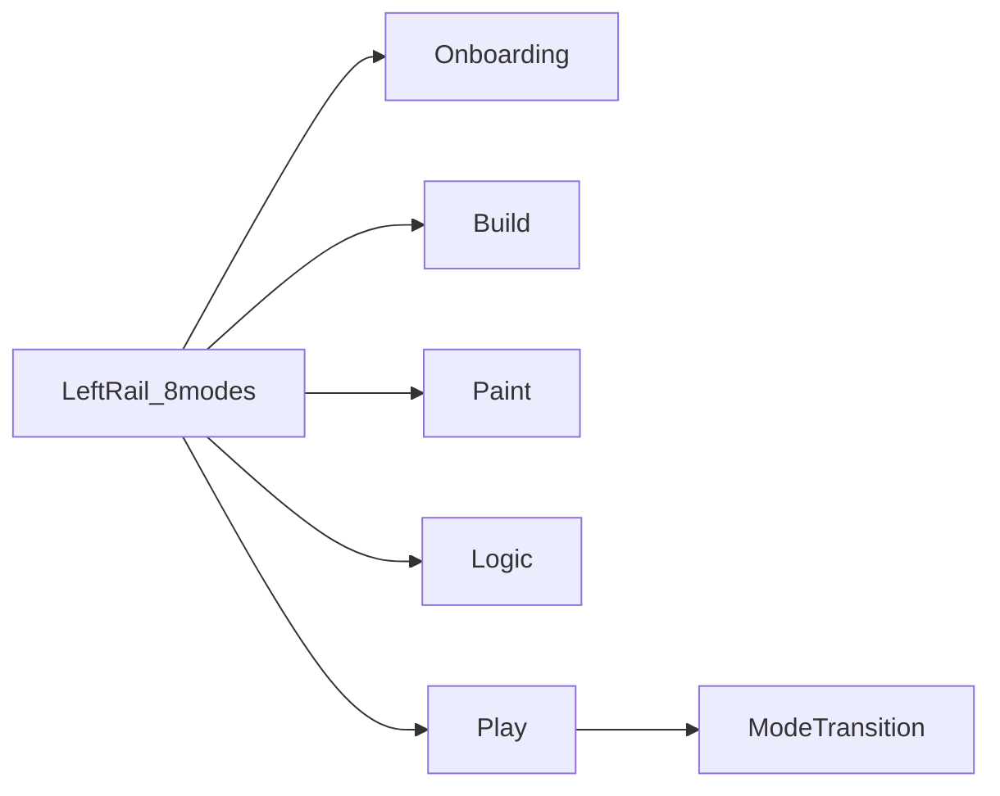

# Phase B (éditeur) — UI/UX, maquette Mode-based v3 hi-fi

| Champ | Valeur |
|-------|--------|
| **ID** | `PHASE-B-EDITOR-UI` |
| **Note** | **Périmètre éditeur** (shell, modes, parcours). [ROADMAP § Phase K](../ROADMAP.md) (section *Phase K*) ; **distinct** de [`PHASE-B`](phase-B-graphe-rendu-compute.md) (render graph + compute). |
| **Roadmap** | [ROADMAP § Phase K](../ROADMAP.md) (éditeur natif, workspace, `www/` allégé) — ce ticket **détaille la référence visuelle et le découpage UI**. **Priorité livraison : natif d’abord** ; `www/` aligné en second (allégé). |
| **Statut** | À faire |
| **Ticket parent / infrastructure** | [Phase K — Éditeur, workspaces, extensions](phase-K-editeur-workspaces.md) (workspace, extensions, thème / layout data-driven) |

**Rappel (produit, inchangé)** : la **feuille de route** et la règle [`.cursor/rules/w3drs-native-editor-priority.mdc`](../../.cursor/rules/w3drs-native-editor-priority.mdc) : jalons **shell / workspace / hi-fi** = **d’abord** le binaire **`w3d-editor`** ([`editor/`](../../editor/)), **`www/`** = **parité d’ergonomie** légère + CI WASM, **pas** l’inversion de priorité. Toute avancée utile côté web (ex. outliner WASM) se lit comme **itération / preuve** à **reporter** sur l’hôte **natif**, pas comme substitut.

## Référence design (source de vérité UX)

- **Maquette** : [`docs/design/Mode-based v3 hi-fi.html`](../design/Mode-based%20v3%20hi-fi.html) (titre onglet : *w3d editor — Mode-based v3 (hi-fi)*).
- **Styles** : [`docs/design/v3-hifi.css`](../design/v3-hifi.css) (importée par le HTML) — **source de vérité visuelle** pour l’implémentation (pas les seuls blocs *sketch* en tête du HTML, qui divergent : voir ci-dessous).
- **Logo** : [`docs/design/w3d_logo.svg`](../design/w3d_logo.svg) (également servi côté `www/` en copie statique) — la marque rail n’est **pas** un carré texte « w3 » : c’est le logo vectoriel.
- **Dette doc mineure (optionnel)** : l’intro de la page peut encore mentionner *v2* dans le H1 — à harmoniser en retouche produit.

### Fidélité visuelle — **reproduction hi-fi dès maintenant**

**Objectif** (ordre **intention** = ordre **livraison**) : aligner **d’abord** le shell **natif** (`w3d-editor` / **egui** + mêmes tokens) puis le shell **`www/`** (CSS / thème data-driven) sur la fiche **v3-hifi**, au plus près du **rendu** de **`v3-hifi.css`** (tailles, rayons, ombres, couleurs sémantiques, rail 48px, modes icône seule, état actif ambre, stage 36px, viewport, FAB, mode Play assombri, etc.).

- **Contrainte** : toute PR sur l’enveloppe éditeur **doit** cibler en **priorité** l’**UI native** quand le jalon y est (rail, outliner, viewport) ; le **web** suit ou duplique pour parité, sans **déplacer** la priorité. Vérification **hi-fi** : mêmes **variables** / règles que `v3-hifi.css` (egui : table de couleurs / style équivalent) — l’intention est **zéro écart volontaire** ; écarts **documentés** en revue.
- **Validation** : comparaison manuelle page maquette (onglets / variantes) + **à terme** tests de **régression visuelle** (snapshots de composants, ou diff image ciblé en CI) dès qu’il existe un pipeline retenu.
- **Note** le bloc CSS **inline** au début de `Mode-based v3 hi-fi.html` (rail 72px, tirets, inversé encre/papier sur le mode actif) est un **wireframe** ; l’**override** `v3-hifi.css` (rail compact, icône seule, sélection ambre) est celle qu’on **reproduit** — ce ticket ne vise **pas** la recopie de l’ancienne armature *sketch* seule.

### Après le shell — intégration auteur (hors DOD de ce ticket pour le premier merge)

- **Arbre ECS** dans l’**outliner**, **sélection** outliner ↔ **viewport** (surbrillance / *outline*), : jalons **suivants** une fois le [workspace Phase K](phase-K-editeur-workspaces.md) en place (données projet) — le ticket Phase B reste la **coquille** et l’**alignement hi-fi** ; le branchement scène/ECS est tracé côté architecture + tickets de suivi.

## Axes prioritaires (alignement [phase-transverses](phase-transverses.md) et [Phase K](phase-K-editeur-workspaces.md))

- **Data-driven** : **thème** (clair/sombre, tokens) et **layout** (docking, panneaux) depuis **fichiers versionnés** — pas de palette ou disposition « uniquement dans le binaire » hors bootstrap minimal documenté.
- **Multithreading** : file de commandes **moteur ↔ UI** **bornée** ; pas de blocage render sur l’UI (voir Phase K).
- **Modularité** : moteur en **crates** ; shell **natif** en tête de file pour les jalons ; consommation via **API stable** ; `www/` = surface **allégée** de la **même ergonomie** (modes, flux) **après** / en parallèle non bloquant, pas l’inverse.

## Écart architecture (existant → cible)

- **Existant** : [`www/`](../../www/) + `khronos-pbr-sample` ; [README design](../design/README.md) listait surtout la v2 — la **v3 hi-fi** complète la référence ; **pas** encore de shell éditeur w3d aligné entièrement sur la maquette (8 modes, onboarding, nudge, etc.).
- **Cible** : un **shell éditeur** (cible **natif** en priorité produit, et/ou **`www/`** selon jalons) implémentant les **flux** v3 (voir périmètre) ; moteur inchangé sur les aspects hors ticket sauf intégration (viewport, bus commandes) décrite dans `architecture.md` au fil des PR.
- **Ajustement** : toute PR UI éditeur indique **quel écran / quel flux** de la maquette elle couvre et met à jour le ticket, `docs/architecture.md` ou le journal si le modèle d’hébergement (process UI, bus) change.

## Périmètre — écrans de la maquette (onglets 01–06)

### Transversal — rail de modes (8) + tête d’espace

- **Rail gauche** : largeur **data-driven** ; défaut **48px** aligné **v3-hifi** (pas 72px wireframe) ; marque **w3d** = **logo SVG** ; **huit modes** avec raccourcis (pastilles) ; état actif = style **ambre** hi-fi.
- **Stage** : en-tête avec **titre** (Caveat / hiérarchie visuelle) + **fil / crumb** (piste d’aide 1 ligne).
- **Mode Play** : **plein écran** côté stage ; seul le rail (skin plus sombre) reste en surface lisible.
- **IA** : **bouton flottant** ✦ ; **panneau chat** contextuel ; **nudge** (suggestion de changement de mode quand l’intention ne colle pas).
- **Tweaks** (démo maquette) : panneau d’ajustements thème/annotations — si porté : rester data-driven (préférence persistée, pas de hardcode de palette hors defaults documentés).

### Onglet 01 — Onboarding (first launch)

- **Premier lancement** : rail **atténué** jusqu’à un **engagement** (choix starter ou validation prompt).
- **Carte centrale** : *What are we making today?* — **3 starters** + **prompt** libre ; clavier **focus** sur le prompt dès l’ouverture.
- **Règles** : le bouton / flux IA peut être **masqué** en first run (pas le héros) selon la maquette.

### Onglet 02 — Build (mode « travail »)

- **Grille** : **outliner** + **viewport** + **inspector** (primitives, transform, props) — pas de fuite des outils des autres modes (peinture, logique) dans le périmètre serré Build.
- Raccourcis **clavier** alignés sur les **pastilles** du rail (B, P, S, L, etc. selon spec retenue en PR).
- **Jalon (impl.)** : outliner alimenté par le même modèle de scène que l’hôte moteur (**`SceneHandles`** / entités) ; **cible de livraison = éditeur natif** ; un **prototype** existe aujourd’hui côté **`www/`** (WASM) — à **porter en priorité** sur `w3d-editor` (panneau latéral, sélection) ; légende **sélection** en bas de viewport côté web en attendant la parité **egui**. **Picking 3D / surbrillance mesh** = API moteur (natif + WASM) — pas de faux picking sans rayon.

### Onglet 03 — Paint

- **Viewport** large + colonne : **swatches**, **brosses** / anneau de prévisualisation, **mats** (aperçu grille).

### Onglet 04 — Logic

- **Graphe** (fond en pointe) : **nœuds** (ports, en-têtes) ; **bibliothèque** de nœuds (colonnes, catégories) ; câblage = flux logique (données déjà : shader graph, blueprints, etc. — câblage moteur hors périmètre *render graph* du [`PHASE-B`](phase-B-graphe-rendu-compute.md) sauf intégration *UI* du même fichier graphe côté éditeur).

### Onglet 05 — Play

- **Fond** immersif, **HUD** (haut centre / stats), **Stop** / indice clavier (Esc) — **même rail** 8 modes avec variante visuelle plutôt sombre.

### Onglet 06 — Mode transition

- **Étude d’animation** (cartes) : comment le shell **passe** d’un mode à l’autre (plis, rideau, *fold*) — jalon *polish* après les modes 01–05 utilisables.

### Portée mermaid (vue synthétique)

## Scène ou projet de test (validation fonctionnelle + UI)

**Même principe que** [Phase K — Scène](phase-K-editeur-workspaces.md#scène-ou-projet-de-test-validation-fonctionnelle) : **`fixtures/phases/phase-k/`** (workspace exemple, extension hello, etc.).

**Critères UI** additionnels (à couvrir par **tests d’intégration** ou **E2E** dès qu’un écran existe) :

| Critère | Mesure / attente |
|--------|-------------------|
| Modes | Au moins **Build** + **un second mode** (ex. Play ou Logic) : commutation **sans crash** ; état actif cohérent sur le rail. |
| Onboarding | (Quand implémenté) scénario **first run** : rail atténué → **commit** → rail actif, **reproductible** (fixture ou config de test). |
| Données | Fichier **thème / layout** modifié → **changement** observable (snapshot, hash, ou log d’arbre d’écran) — [DOD Phase K](phase-K-editeur-workspaces.md#definition-of-done-dod). |

- **DOR (scène)** : [ ] alignement avec le README de `phase-k` + critères UI listés ici (PR ou document).
- **DOD (scène)** : [ ] au moins un **test** (cargo / E2E) **emprunte** le chemin `fixtures/phases/phase-k/` **ou** un sous-chemin documenté ; critères **UI** de la table ci-dessus **vérifiables** en CI ou checklist PR.

---

## Definition of Ready (DOR)

- [ ] **Maquette v3** + **`v3-hifi.css`** + logo **`w3d_logo.svg`** présents sous [`docs/design/`](../design/README.md) ; cible = **fiche hi-fi** (voir section *Fidélité visuelle*), pas l’ancienne armature *sketch* seule.
- [ ] **Ordre de priorité** des **jalons d’écran** : **d’abord sur l’éditeur natif** (souvent : rail + Build + Play, puis Onboarding, Paint, Logic, transition) ; **ensuite** / en parallèle le shell `www/` — **écrit** dans le ticket ou l’issue fille.
- [ ] **Schéma** ou spec **fichier** thème + layout (même brouillon) s’il manque, ou tâche explicite d’en produire un avant le premier merge layout.
- [ ] `cargo xtask check` vert sur la branche de base.
- [ ] Cohérence confirmée avec [Phase K — DOR](phase-K-editeur-workspaces.md#definition-of-ready-dor) pour workspace / extensions (jalons communs non dupliqués inutilement).

---

## Definition of Done (DOD)

- [ ] **Shell** : **d’abord** le **natif** (rail / stage / FAB / thème / variantes de mode) — revue **conforme `v3-hifi`** (ou équivalent **egui** documenté) ; *pixel hi-fi* comme objectif ; **`www/`** en **parité** sans anticiper le natif, écarts listés s’il y en a.
- [ ] Pour chaque **jalon** livré : **tests** (Rust et/ou TypeScript) exécutant le **code modifié** (politique [CONTRIBUTING — Testing](../../CONTRIBUTING.md#testing-policy)) ; en priorité **tests client natif** / `examples/` quand le jalon est l’éditeur **natif** ; **E2E** `www/` (thirtyfour / chromiumoxide) si le jalon touche **aussi** le shell web.
- [ ] Aucun **flux** de la section *Périmètre* marqué *fait* **sans** critère de reproductibilité (fixture, config, test).
- [ ] Mise à jour de [`docs/journal.md`](../journal.md) lors d’un jalon **significatif** (stack UI, preuve d’écran, lien PR).

### Outils de validation

| Outil | Rôle | Seuil |
|-------|------|-------|
| `cargo test` | Crates éditeur / shell | 0 échec. |
| `cargo xtask check` | Projet, cross-targets concernés | Vert. |
| UI natif | Snapshots, golden, ou arbre d’écran (outil défini en PR) | Comme Phase K. |
| `thirtyfour` / `chromiumoxide` | Smoke **modes** / parcours `www/` | Vert en CI si applicable. |
| Couverture | Diff sur le périmètre | Seuil sur le **diff** (voir CONTRIBUTING). |

---

## Journal

- [ ] [`../journal.md`](../journal.md) : liens **maquette v3**, jalons (rail, Build, Play, …), outils de test retenus.

---

*Ticket créé : 2026-04-26 — complète la [Phase K](phase-K-editeur-workspaces.md) par la **référence hi-fi** et le **découpage écran** sans conflit avec le ticket [PHASE-B](phase-B-graphe-rendu-compute.md) render graph.*
